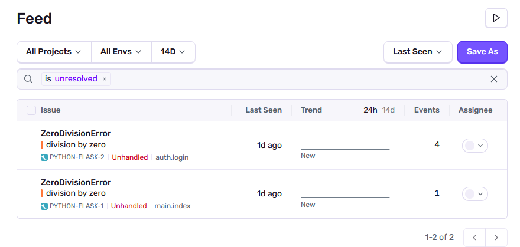
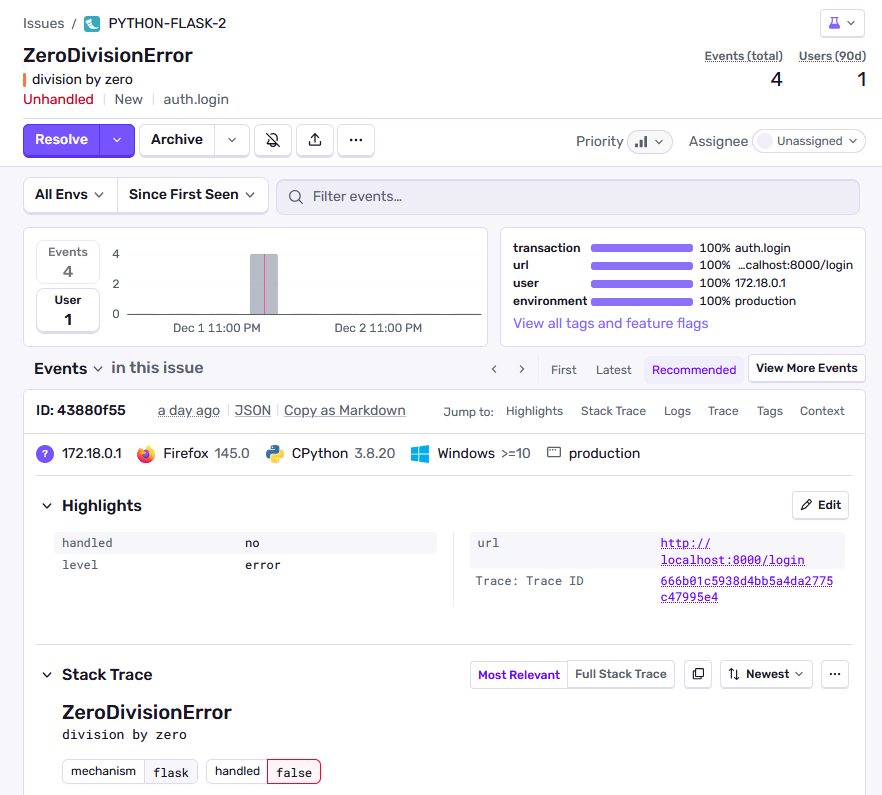

# Teknisk studie - Sentry - alry23, mann23

## Vad är Sentry och vad gör det?
Sentry är ett verktyg som används för att automatiskt upptäcka och meddela utvecklare om problem i applikationen. Till exempel att spåra en långsam request till ett långsamt api, databas query eller generella errors.

## Hur man inkorporerar Sentry i Microblog.
För att lägga till sentry i microblog så behöver vi först skapa ett konto på sentry och skapa ett projekt. I setup processen så kan man välja vilken typ av projekt det är, i vårt fall så blir det Flask.

Näst så läger vi till sentry-sdk som ett requirement i requirements.txt så att vi kan installera det när vi kör pip install i våra script. Sedan används sdkn i samma fil där flask appen initeras, i detta fallet blir det __init__.py. Sentry ger oss en dsn länk för att koppla samman flask appen och sentry projektet, vi valde att lägga den länken som en .env variabel för att den kändes som känslig information. 

För att testa att sentry fungerar så skapade vi några errors i vårat api. När vi sedan körde sentry så visades de i vår feed.

## Hur passar Sentry in i och relaterar till devops?
Vi tror Sentry passar bra som ett verktyg inom devops för att det ger oss notiser om saker går sönder i koden eller om prestandan är låg i vissa requests. Sentry ger oss mer feedback från vår applikation så att vi snabbare kan diagnostisera problemet. Sentry kan också användas tillsammans med slack or jira för att automatiskt skapa tickets eller skicka meddelanden till teamet när ett problem uppstår.

## Screenshots på hur Sentry funkar.

